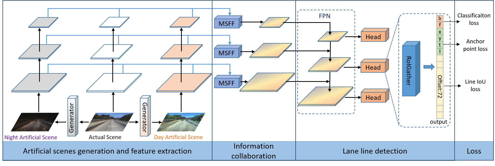
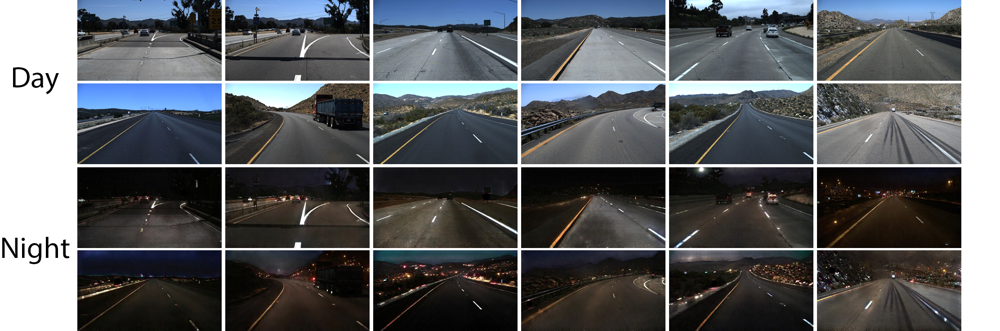
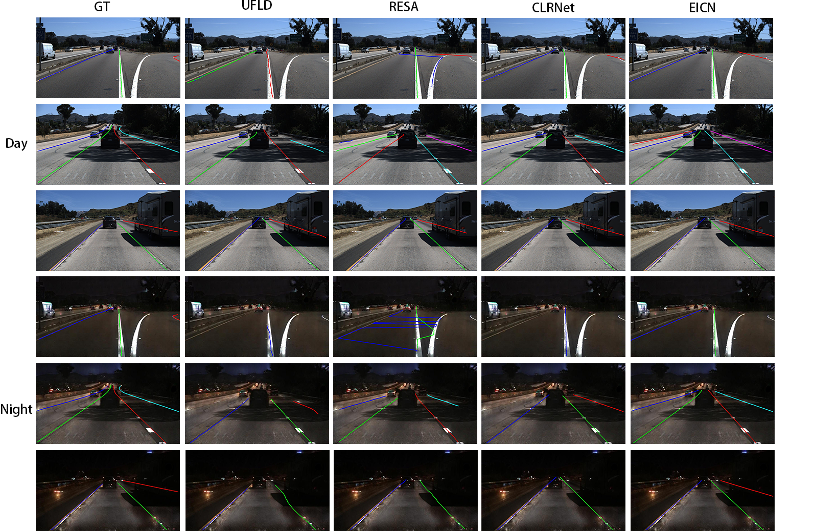

<div align="center">
</div>


<div align="center">

# 24-hour Lane Line Detection using Image Enhancement and Collaboration

</div>


Pytorch implementation of the paper "[24-hour Lane Line Detection using Image Enhancement and Collaboration]()" (The paper is under review).

## Introduction

- We construct two generators using unlabeled data to realize the mutual transformation between the daytime scenes and the nighttime scenes. The generated virtual data enhances the diversity of real data, compensates for the limitations of real scenes, and improves the detection accuracy of the model. 
- We propose an innovative module, the Multi-Spatial Feature Fusion (MSFF), which preserves the spatial information of both real and generated data. This module enables the joint utilization of real scene and artificial scene data, effectively reducing the impact of artificial noise.
- Experimental results on TuSimple, Night TuSimple, and CULane demonstrate the proposed method's effectiveness for 24-hour lane line detection. This proves the feasibility of applying parallel theory for 24-hour lane line detection.

## Installation

### Prerequisites
Only test on Ubuntu 20.04 with:
- Python >= 3.8 (tested with Python3.8.17)
- PyTorch >= 2.0 (tested with Pytorch2.0.1)
- CUDA (tested with cuda_11.3)
- Other dependencies described in `requirements.txt`

### Clone this repository
Clone this code to your workspace. 
We call this directory as `$PSIC_ROOT`

```Shell
git clone https://github.com/xiongxiong1996/PSIC
```

### Create a conda virtual environment and activate it (conda is optional)

```Shell
conda create -n PSIC python=3.8 -y
conda activate PSIC
```

### Install dependencies

```Shell
# Install pytorch via pip firstly.
pip install torch torchvision torchaudio

# Install python packages
pip install -r requirements.txt
python setup.py build develop
```

### Data preparation

#### CULane

Download [CULane](https://xingangpan.github.io/projects/CULane.html). Then extract them to `$CULANEROOT`. Create link to `data` directory.

```Shell
cd $PSIC_ROOT
mkdir -p data
ln -s $CULANEROOT data/CULane
```

For CULane, you should have structure like this:
```
$CULANEROOT/data/CULane
	--driver_23_30frame    # data folders x6
	--driver_37_30frame
	--driver_100_30frame
	--driver_161_90frame
	--driver_182_30frame
	--driver_193_90frame
	--laneseg_label_w16    # lane segmentation labels
	--list                 # data lists
                   
```

#### CULane Day

Download [CULane](https://xingangpan.github.io/projects/CULane.html). Then extract them to `$CULANEDAYROOT`. We filter CULane's training set, select only the daytime data, modify the `$CULANEDAYROOT/list/train_gt.txt`, delete the nighttime index. The Modified [train_gt.txt](https://xingangpan.github.io/projects/CULane.html) can be download directly. Create link to `data` directory. 

```Shell
cd $PSIC_ROOT
mkdir -p data
ln -s $CULANEDAYROOT data/CULane
```

For CULane_day, the structure is the same as CULane.

#### Tusimple

Download [Tusimple](https://github.com/TuSimple/tusimple-benchmark/issues/3). Then extract them to `$TUSIMPLEROOT`. Create link to `data` directory.

```Shell
cd $PSIC_ROOT
mkdir -p data
ln -s $TUSIMPLEROOT data/tusimple
```

For Tusimple, you should have structure like this:
```
$TUSIMPLEROOT
	--clips # data folders
	--lable_data_0313.json # label json file x3
	--lable_data_0531.json 
	--lable_data_0601.json 
	--test_tasks_0627.json
	--test_label.json # test label json file
	--seg_label # run generate_seg_tusimple.py
```

For Tusimple, the segmentation annotation is not provided, hence we need to generate segmentation from the json annotation. 

```Shell
python tools/generate_seg_tusimple.py --root $TUSIMPLEROOT
# this will generate seg_label directory
```

####  Night Tusimple

Download [Night Tusimple](resa/data). Then extract them to `$NIGHTTUSIMPLEROOT`. Create link to `data` directory.

```shell
cd $PSIC_ROOT
mkdir -p data
ln -s $NIGHTTUSIMPLEROOT data/tusimple_night
```

Some images of Night Tusimple.



## Generator preparation


The trained model used in this paper is available [day2night_net_G.pth & night2day_net_G.pth](https://pan.baidu.com/s/1WVE0bBS9BBxUQtC_QEUa2w?pwd=vox8). Then move them to `$PSIC_ROOT/pth`.

In this article, reference to the method described in [Arruda et al. 2019](https://github.com/LCAD-UFES/publications-arruda-ijcnn-2019), 3,000 images each from daytime and nighttime scenes are used to train the generators.


## Getting Started

### Training
For training, run
```Shell
python main.py --config [configs/path_to_your_config] --gpus [gpu_num]
```

For example, run
```Shell
python main.py --config configs/PSIC/resnet18_culane.py --gpus 0
```

### Validation
For testing, run
```Shell
python main.py --config [configs/path_to_your_config] --[test|validate] --load_from [path_to_your_model] --gpus [gpu_num]
```

For example, run
```Shell
python main.py --config configs/PSIC/resnet18_culane.py --validate --load_from pth/culane_resnet18.pth --gpus 0
```

Currently, this code can output the visualization result when testing, just add `--view`.
We will get the visualization result in `work_dirs/xxx/xxx/visualization`.

## Results

Visualization results of UFLD, RESA, CLRNet and PSIC on Tusimple and Night Tusimple.



### Tusimple

State-of-the-art results on TuSimple. Results was computed using the official source code. Best results are in bold.

|   Method   | Backbone  |    F1     |  ACC  |    FP    |    FN    |
| :--------: | :-------: | :-------: | :---: | :------: | :------: |
|    SCNN    |   VGG16   |   95.97   | 96.53 |   6.17   | **1.80** |
|    UFLD    | ResNet18  |   87.58   | 95.82 |  19.05   |   3.92   |
|   UFLDv2   | ResNet18  |   96.16   | 95.65 |   3.06   |   4.61   |
|   UFLDv2   | ResNet34  |   96.22   | 95.56 |   3.18   |   4.37   |
|    RESA    | ResNet34  |   96.93   | 96.82 |   3.63   |   2.48   |
|  CondLane  | ResNet18  |   97.01   | 95.48 |   2.18   |   3.80   |
|  CondLane  | ResNet34  |   96.98   | 95.37 |   2.20   |   3.82   |
|  CondLane  | ResNet101 |   97.24   | 96.54 |   2.01   |   3.50   |
| CurveLane  | ResNet18  |   95.02   | 95.41 |   5.32   |   4.60   |
| CurveLane  | ResNet34  |   95.47   | 95.65 |   5.13   |   3.87   |
|   CLRNet   | ResNet18  |   97.89   | 96.82 |   2.28   |   1.92   |
|   CLRNet   | ResNet34  |   97.82   | 96.87 |   2.27   |   2.08   |
|   CLRNet   | ResNet101 |   97.62   | 96.83 |   2.37   |   2.38   |
|  FLAMNet   | ResNet18  |   97.83   | 96.58 |   2.85   |   1.96   |
|  FLAMNet   | ResNet34  |   97.92   | 96.94 |   2.43   |   1.89   |
| PSIC(ours) | ResNet18  | **98.04** | 96.83 | **1.80** |   2.12   |
| PSIC(ours) | ResNet34  |   97.87   | 96.80 |   1.87   |   2.39   |
| PSIC(ours) | ResNet101 |   97.51   | 96.57 |   1.85   |   3.16   |

### Night Tusimple 

State-of-the-art results on Night TuSimple. Results was computed using the official source code. Best results are in bold.

|   Method   | Backbone  |    F1     |    ACC    |    FP    |    FN    |
| :--------: | :-------: | :-------: | :-------: | :------: | :------: |
|    SCNN    |   VGG16   |   74.11   |   87.62   |  23.17   |  27.72   |
|    UFLD    | ResNet18  |   60.87   |   87.11   |   42.4   |   31.6   |
|    RESA    | ResNet34  |   94.21   |   93.65   |   5.24   |   7.62   |
|  CondLane  | ResNet18  |   94.32   |   93.12   |   3.64   |   7.64   |
|  CondLane  | ResNet34  |   92.78   |   90.36   |   2.63   |  11.39   |
|  CondLane  | ResNet101 |   92.28   |   90.31   |   2.99   |  12.01   |
| CurveLane  | ResNet18  |   82.64   |   86.15   |   14.4   |   21.5   |
| CurveLane  | ResNet34  |   90.47   |   89.43   |   6.00   |   13.8   |
|   CLRNet   | ResNet18  |   90.2    |   87.09   |   4.31   |   16.5   |
|   CLRNet   | ResNet34  |   90.45   |   86.03   |   3.00   |  17.48   |
|   CLRNet   | ResNet101 |           |           |          |          |
|  FLAMNet   | ResNet18  |   89.88   |   86.72   |   4.33   |  17.21   |
|  FLAMNet   | ResNet34  |   86.36   |   79.85   |   4.46   |  25.72   |
| PSIC(ours) | ResNet18  |   96.33   |   94.65   |   1.98   |   5.50   |
| PSIC(ours) | ResNet34  |   95.53   |   93.42   |   2.06   |   7.11   |
| PSIC(ours) | ResNet101 | **97.50** | **96.59** | **1.86** | **3.17** |

### CULane

Comparison with state-of-the-art results on CULane dataset with IoU threshold = 0.5. For cross, only FP are shown. Best results are in bold and second best underlined.

|     Method      | Backbone  |    Normal    |    Crowd     |    Dazzle    |    Shadow    |    Noline    |   Arrow    |    Curve     |   Cross    |    Night     |    Total     |
| :-------------: | :-------: | :----------: | :----------: | :----------: | :----------: | :----------: | :--------: | :----------: | :--------: | :----------: | :----------: |
|      SCNN       |   VGG16   |     90.6     |     69.7     |     58.5     |     66.9     |     43.4     |    84.1    |     64.4     |    1990    |     66.1     |     71.6     |
|      RESA       | ResNet34  |     91.9     |     72.4     |     66.5     |      72      |     46.3     |    88.1    |     68.6     |    1896    |     69.8     |     74.5     |
|      RESA       | ResNet50  |     92.1     |     73.1     |     69.2     |     72.8     |     47.7     |    88.3    |     70.3     |    1503    |     69.9     |     75.3     |
|      UFLD       | ResNet18  |     87.7     |     66.0     |     58.4     |     62.8     |     40.2     |    81.0    |     57.9     |    1743    |     62.1     |     68.4     |
|      UFLD       | ResNet34  |     90.7     |     70.2     |     59.5     |     69.3     |     44.4     |    85.7    |     69.5     |    2037    |     66.7     |     72.3     |
|     UFLDv2      | ResNet18  |     91.8     |     73.3     |     65.3     |     75.1     |     47.6     |    87.9    |     68.5     |    2075    |     70.7     |     75.0     |
|     UFLDv2      | ResNet34  |     92.5     |     74.8     |     65.5     |     75.5     |     49.2     |    88.8    |     70.1     |    1910    |     70.8     |     76.0     |
|      SGNet      | ResNet18  |    91.42     |    74.05     |    66.89     |    72.17     |    50.16     |   87.13    |    67.02     |    1164    |    70.67     |    76.12     |
|      SGNet      | ResNet34  |    92.07     |    75.41     |    67.75     |    74.31     |     50.9     |   87.97    |    69.65     |    1373    |    72.69     |    77.27     |
|    CondLane     | ResNet18  |    92.87     |    75.79     |    70.72     |    80.01     |    52.39     |   89.37    |     72.4     |    1364    |    73.23     |    78.14     |
|    CondLane     | ResNet34  |    93.38     |    77.14     |    71.17     |    79.93     |    51.85     |   89.89    |    73.88     |    1387    |    73.92     |    78.74     |
|    CondLane     | ResNet101 |    93.47     |    77.44     |    70.93     |    80.91     |    54.13     |   90.16    | <u>75.21</u> |    1201    |     74.8     |    79.48     |
|    Curvelane    | ResNet18  |    90.22     |     73.2     |    62.49     |    70.91     |     45.3     |   84.09    |    56.64     |    1166    |     68.7     |    73.67     |
|    Curvelane    | ResNet34  |    91.59     |     73.2     |     69.2     |    76.74     |    48.05     |   87.16    |    62.45     |  **888**   |     69.9     |    75.57     |
|     Clrnet      | ResNet18  |     93.3     |    78.33     |    73.71     |    79.66     |    53.14     |   90.25    |    71.56     |    1321    |    75.11     |    79.58     |
|     Clrnet      | ResNet34  |    93.49     |    78.06     |    74.57     |    79.92     |    54.01     |   90.59    |    72.77     |    1216    |    75.02     |    79.73     |
|     Clrnet      | ResNet101 |  **93.85**   |    78.78     |    72.49     |    82.33     | <u>54.50</u> |   89.79    |  **75.57**   |    1262    |    75.51     |    80.13     |
|     Clrnet      |   DLA34   |    93.73     |  **79.59**   |  **75.30**   | <u>82.51</u> |  **54.58**   |   90.62    |    74.13     |    1155    |    75.37     | <u>80.47</u> |
| PSIC(only day)  | ResNet18  |    93.34     |    77.91     |     74.5     |    78.39     |     51.9     |   90.05    |    69.14     |    990     |    75.13     |    79.55     |
| PSIC(only day)  | ResNet34  |    93.55     |    78.49     |    74.01     |    80.88     |    52.35     | **90.91**  |    69.11     |    987     |    75.63     |    79.99     |
| PSIC(only day)  | ResNet101 |    93.58     |    78.99     |    72.98     |    81.79     |    54.20     |   90.62    |    71.57     |    992     | <u>75.77</u> |    80.37     |
| PSIC(only day)  |   DLA34   | <u>93.82</u> |    78.89     | <u>75.29</u> |    79.25     |    53.16     |   90.51    |    72.30     |    1043    |    75.50     |    80.21     |
| PSIC(day+night) | ResNet18  |    93.42     |    77.98     |    74.91     |    78.03     |    52.43     |   90.14    |    70.17     |    997     |    75.22     |    79.68     |
| PSIC(day+night) | ResNet34  |    93.65     |    78.83     |    74.73     |    81.11     |    53.27     |   90.57    |    72.15     | <u>977</u> |    75.76     |    80.27     |
| PSIC(day+night) | ResNet101 |    93.79     |    79.11     |    73.25     |  **82.60**   |    54.09     |   90.60    |    72.69     |    978     |    75.50     |    80.44     |
| PSIC(day+night) |   DLA34   |    93.69     | <u>79.15</u> |    74.76     |    82.46     |    54.00     | <u>90.68** |    73.87     |    1069    |  **76.19**   |  **80.53**   |

## Citation

If our paper and code are beneficial to your work, please consider citing:
```
@InProceedings{Zheng_2022_CVPR,
    author    = {**,
    title     = {**,
    booktitle = {**,
    month     = {**,
    year      = {**,
    pages     = {**
**
```

## Acknowledgement
<!--ts-->

* [pytorch/vision](https://github.com/pytorch/vision)
* [junyanz/CycleGAN](https://github.com/junyanz/CycleGAN)
* [LCAD-UFES/publications-arruda-ijcnn-2019](https://github.com/LCAD-UFES/publications-arruda-ijcnn-2019)
* [Turoad/CLRNet](https://github.com/Turoad/CLRNet)
* [ZJULearning/resa](https://github.com/ZJULearning/resa)
* [cfzd/Ultra-Fast-Lane-Detection](https://github.com/cfzd/Ultra-Fast-Lane-Detection)
* [aliyun/conditional-lane-detection](https://github.com/aliyun/conditional-lane-detection)
* [SoulmateB/CurveLanes](https://github.com/SoulmateB/CurveLanes)
* <!--te-->